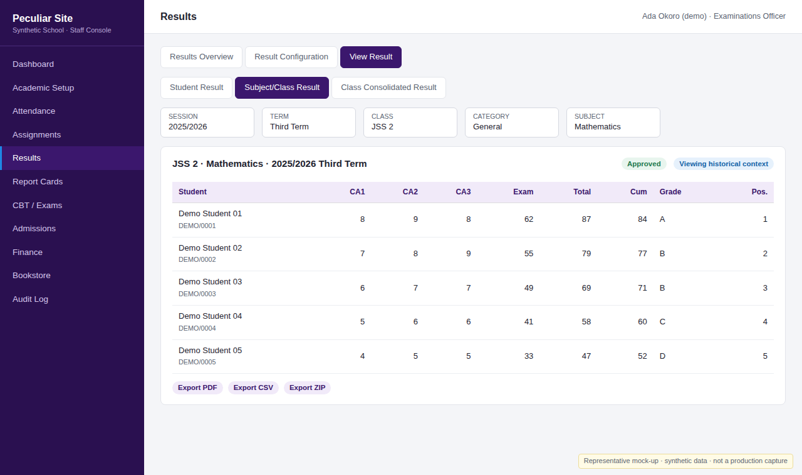
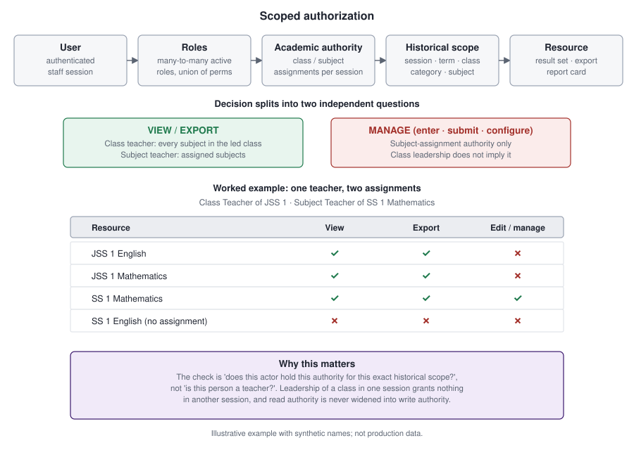
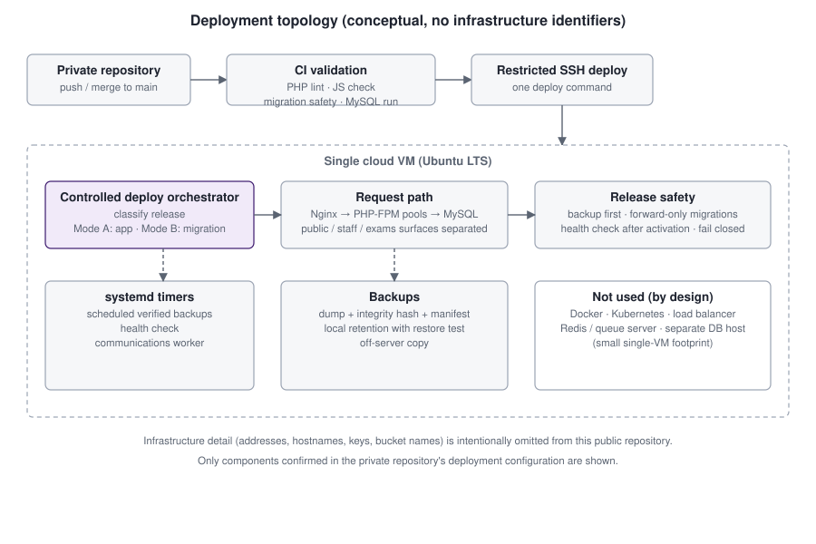

# Peculiar Site

**School operations and academic management platform — public engineering showcase**

Peculiar Site is a server-rendered PHP/MySQL platform for running a secondary school (JSS 1 – SS 3): academic structure, teaching assignments, attendance, results and report cards, finance, bookstore, computer-based tests, admissions, and staff/student/parent portals.

> **Source availability.** The production application is private because it holds a real institution's operating logic. This repository is a public case study of that system: architecture, design decisions, security reasoning, testing evidence and project history. It contains documentation, diagrams and synthetic screenshots only — no production source, schema, configuration, or data.

Everything here is derived from the private repository (code, design documents, tests, deployment configuration, and commit history). Claims are labelled by evidence level; see [Status vocabulary](#status-vocabulary).

---

## At a glance

| | |
|---|---|
| **What it is** | A school operations platform with separate public, staff, portal and examination surfaces |
| **Problem** | Replace spreadsheets and paper for academic records, results, fees and admissions, with real accountability |
| **My role** | Architecture, data model, authorization, result pipeline, deployment tooling and tests (see [project evolution](docs/project-evolution.md#working-method) for how assisted development is disclosed) |
| **Stack** | Native PHP 8, MySQL 8, Nginx + PHP-FPM, Dompdf, OpenSpout, GitHub Actions, Ubuntu on a single cloud VM |
| **History** | 810 commits on 35 active days (27 Jul – 28 Sep 2026), 131 merge commits |
| **Size** | ~106 PHP modules in `includes/`, 88 forward-only migrations, 235 test programs run by the harness |
| **Interesting because** | Historical academic context, scoped authorization, a single result calculation path feeding every view and export, maker-checker workflows, append-only financial and audit records, controlled production deploys |

## Architecture

One codebase is served through host-based routing to separate PHP-FPM pools (public/portal, staff, and two examination surfaces) so a student or parent request never runs with staff database credentials. MySQL holds separated logical schemas for the staff domain and the portal domain. Details: [docs/architecture.md](docs/architecture.md).

## Engineering highlights

1. **Historical academic context.** Every result read is keyed by Session + Term + Class + Category + Subject (+ Student). Viewing 2019/2020 results never depends on, or changes, the school's active term. → [Academic model](docs/architecture.md#academic-model)
2. **One calculation path.** Totals, cumulative scores, class averages and positions come from one calculation service. Explorer views, PDFs, CSV, ZIP and report cards are renderers over the same read models, so they cannot disagree. → [Results system](docs/results-system.md)
3. **Scoped authorization.** A class teacher can view and export every subject in the class they lead but cannot edit any of them; a subject teacher manages only assigned subjects. Authority is per session, not "is a teacher". → [Authorization](docs/authorization-and-rbac.md)
4. **A single export boundary.** Nine export types go through one route and one dispatcher: normalize → validate → authorize → read model → render → audit. → [Export architecture](docs/export-architecture.md)
5. **Integrity by design.** Append-only payment and audit records enforced by database triggers, maker-checker separation of duties, CSRF on state changes, output escaping, CSV formula-injection defence, private no-store documents. → [Security and data integrity](docs/security-and-data-integrity.md)
6. **Careful production delivery.** CI validation, then a controlled deploy that classifies each release, takes a backup first, applies forward-only migrations, and health-checks afterwards. → [Deployment](docs/deployment.md)

*Representative mock-up with synthetic data. See [Screenshots](#screenshots).*

## Selected case studies

| # | Case study | Read |
|---|---|---|
| 1 | Result system architecture: from entry to official report card | [docs/results-system.md](docs/results-system.md) |
| 2 | Scoped teacher authorization (class teacher vs subject teacher vs administrator) | [docs/authorization-and-rbac.md](docs/authorization-and-rbac.md) |
| 3 | Unified export engine: consolidating export paths behind one boundary | [docs/export-architecture.md](docs/export-architecture.md) |
| 4 | Security and data integrity: problem → decision → result | [docs/security-and-data-integrity.md](docs/security-and-data-integrity.md) |
| 5 | Production engineering: deployment, backups, operational constraints | [docs/deployment.md](docs/deployment.md) |

Supporting material: [Engineering decisions](docs/engineering-decisions.md) · [Project evolution](docs/project-evolution.md) · [Testing and QA](docs/testing-and-qa.md) · [Evidence](evidence/)

## Security and authorization

Authorization combines a many-to-many role model with academic authority derived from assignments, evaluated against an explicit historical scope.

Also covered: CSRF, escaping, IDOR-resistant identifiers, generic login failures, email one-time codes for the technical account, audit redaction rules, separation of duties, and a protected-administrator model. See [security and data integrity](docs/security-and-data-integrity.md) and the [security review notes](evidence/security-review.md).

## Testing and quality

The project uses a custom PHP test harness rather than a framework. On 28 Sep 2026 the static suite was run against the current private `main` and finished with **208 passed, 0 failed, 27 skipped** (the skips are disposable-MySQL rehearsal checks that need a database and were not run in that environment). All 436 PHP files lint cleanly. Many checks are source-contract tests rather than end-to-end tests; that limitation is stated openly in [Testing and QA](docs/testing-and-qa.md) and [evidence/testing.md](evidence/testing.md).

## Deployment

A single small cloud VM runs Nginx, PHP-FPM and MySQL. GitHub Actions validates each change; a root-owned controlled-deploy orchestrator classifies the release as a standard application release or a controlled migration release. See [docs/deployment.md](docs/deployment.md). Infrastructure identifiers are intentionally omitted.

## Project evolution

Foundation and academic structure (Aug 2026) → identity, RBAC and portal separation → finance → the **Omega** programme (identity, separation of duties, technical isolation, governance) → **Orbit** result system (phases A–J) → **Post-Orbit** Result Explorer, Student Result PDF, unified export engine, report-card integration, compatibility cleanup and regression QA. Timeline with evidence: [docs/project-evolution.md](docs/project-evolution.md) and [evidence/milestones.md](evidence/milestones.md).

## Status vocabulary

| Label | Meaning |
|---|---|
| Implemented | Present in the private codebase |
| Implemented and tested | Also covered by repository tests |
| Implemented and deployed | Repository status records say it was released to production |
| Planned | Designed, not built |
| Historical / retired | Built earlier, later replaced |

Per-area status is listed in [docs/architecture.md](docs/architecture.md#module-status). Production usage numbers, uptime and performance figures are deliberately not claimed: the repository does not contain evidence for them.

## Screenshots

Screenshots in [`screenshots/`](screenshots/) are **representative mock-ups built with synthetic users, students, scores and amounts**. They mirror the real interface's structure and terminology but are not captures of production. No real school record appears anywhere in this repository.

| | |
|---|---|
| [Dashboard](screenshots/dashboard.png) | [Result Explorer](screenshots/result-explorer.png) |
| [Student Result](screenshots/student-result.png) | [Class consolidated result](screenshots/class-result.png) |
| [Report card](screenshots/report-card.png) | [Academic setup](screenshots/academic-setup.png) |
| [Finance](screenshots/finance.png) | |

## Technology stack

Only technologies confirmed in the private repository are listed.

| Area | Technology |
|---|---|
| Backend | Native PHP 8.1+ (no framework), server-rendered HTML, CSS, framework-free JavaScript |
| Database | MySQL 8 via PDO, ordered forward-only SQL migrations |
| Web server | Nginx, PHP-FPM (multiple pools), Certbot/Let's Encrypt |
| PDF and files | Dompdf 3, GD (PNG/WebP logos), OpenSpout (spreadsheet output), ZipArchive |
| Auth | Session-based auth, password hashing, database-backed RBAC, CSRF tokens, email one-time codes (technical account) |
| Email | External transactional email provider, driven by a database outbox and worker |
| Testing | Custom PHP harness (static contract checks, MySQL integration and rehearsal checks) |
| Delivery | Git, GitHub Actions, shell deploy tooling, systemd timers |
| Backups | `mysqldump` sets with manifests and SHA-256 hashes, local retention, off-server copy |

## Privacy and source availability

Nothing here is a copy of the production system. It contains no source, schema, migrations, credentials, hostnames, addresses, or real people's data. The institution is not named. See [evidence/security-review.md](evidence/security-review.md) for the pre-publication checks.

Content in this repository is © its author, all rights reserved.
