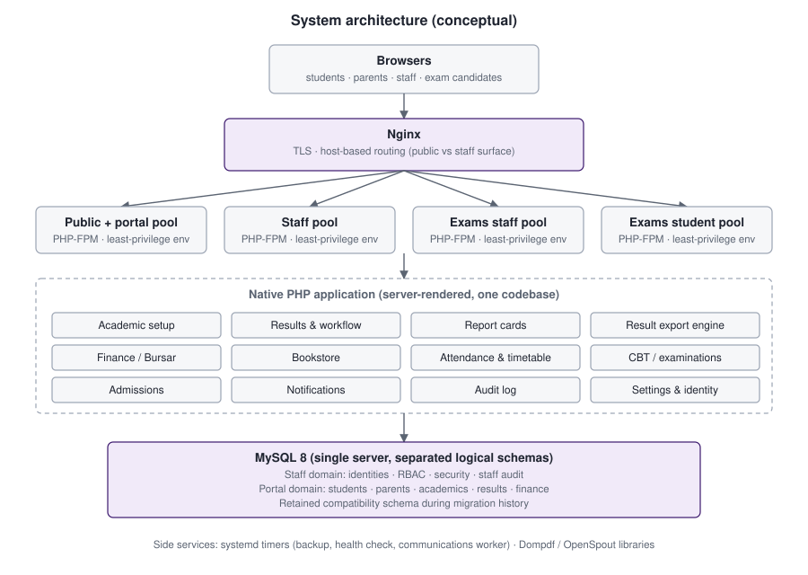
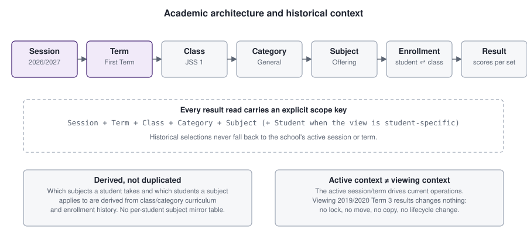

# Architecture

Conceptual architecture of Peculiar Site. Implementation detail is intentionally withheld; see the [README](../README.md#privacy-and-source-availability).

## System shape

- **Server-rendered monolith.** One PHP codebase, no framework, no client-side application. Forms post to the server, which validates, authorizes and renders. A small amount of framework-free JavaScript handles filters, confirmations and UI behaviour.
- **Separate surfaces, one codebase.** Public site and student/parent portal are served on one host; staff administration on another; the computer-based examination surface has its own staff and student entry points. Nginx routes by host, and each surface maps to its own PHP-FPM pool.
- **Least-privilege runtime.** The portal pool receives only portal database credentials. A student or parent request cannot reach staff identity or RBAC data even if application code were compromised. Session cookies are host-only and named differently per surface.
- **Separated logical databases on one MySQL server.** The staff domain (identities, roles, permissions, security data, staff audit) and the portal domain (students, parents, enrollment, academics, results, finance) are separate schemas. A retained compatibility schema carries the pre-split history; a migration ledger is kept on each.
- **Modules, not services.** Results, report cards, finance, bookstore, attendance, CBT, admissions and notifications are PHP modules with shared authorization, audit and PDF infrastructure. No queue server, cache server or container runtime is used.

## Academic model

The academic hierarchy is **Session → Term → Class → Category → Subject → Enrollment → Result**.

- A **Class** (for example JSS 1) can have **Categories** (for example General, Science, Arts, Commercial in senior classes).
- A **Subject offering** is defined against a class and category. Which students a subject applies to is *derived* from curriculum and enrollment rather than stored as a per-student subject list. This removes a whole class of drift bugs (a student registered for a subject the class does not offer, or missing from one it does).
- **Enrollment** is historical: a student's class in a given session is a record, so old sessions remain reproducible after promotion.
- **Results** are grouped into a result set per session + term + class + subject (+ category), which owns workflow state and the responsible teacher.

### Historical context

The active session/term drives *current* operations. Result viewing uses an explicit selected context instead. Selecting an older term for viewing does not change the active context, lock or unlock configuration, copy or move results, or alter lifecycle state. Every read function receives explicit identifiers and never silently substitutes the active session.

## Authorization at a glance

Roles are many-to-many and their permissions are unioned. Roles alone are not enough for academic data: teaching authority comes from per-session assignments (class teacher, assistant class teacher, subject teacher), checked against the exact scope requested. See [authorization-and-rbac.md](authorization-and-rbac.md).

## Cross-cutting infrastructure

| Concern | Approach |
|---|---|
| Audit | One central service writes allow-listed events to an append-only table; database triggers reject update and delete |
| PDF | Dompdf with remote resources disabled and a restricted root; generated in memory on request; private, no-store responses |
| Notifications | In-app notifications plus a database outbox drained by a scheduled worker with idempotent delivery keys |
| Settings | School identity in typed database settings; secrets, URLs and credentials remain environment-only |
| Migrations | Ordered, forward-only SQL; deploy tooling classifies each migration for safety |

## Module status

Status is taken from the private repository's tests, status ledgers and deployment records at the time of writing (28 Sep 2026). "Deployed" means the repository's own status documents record a production release; it does not imply any usage figure.

| Module | Status |
|---|---|
| Identity, RBAC, multi-role authority, protected administrator model | Implemented, tested, deployed |
| Technical (non-institutional) root account with email one-time code | Implemented, tested, deployed |
| Academic structure, class curriculum, enrollment, progression | Implemented, tested, deployed |
| Attendance and timetable | Implemented, tested, deployed |
| Assignments (homework) | Implemented, tested |
| Result configuration, entry, review/approval, amendments (Orbit A–J) | Implemented, tested, deployed |
| Report cards and class ZIP (Orbit H) | Implemented, tested, deployed |
| Result Explorer, Student Result PDF, unified export engine (Post-Orbit PO-1 – PO-9) | Implemented and tested; merged 28 Sep 2026; production acceptance not yet recorded in the repository |
| Finance: fee structures, charges, payments, credits, concessions | Implemented, tested, deployed |
| Bookstore: inventory, sales, pre-orders, receipts | Implemented, tested; latest amendments recorded as awaiting review in the last status ledger |
| CBT / examinations (authoring, runtime, grading, separate surfaces) | Implemented, tested |
| Admissions (public application, staff review, provisioning) | Implemented, tested, deployed (manual operator acceptance recorded) |
| Notifications and email outbox worker | Implemented, tested, deployed |
| Parent portal | Implemented |
| Audit log viewer | Implemented, tested, deployed |
| Legacy `admin` role compatibility | Historical / retired path |
| Pre-Orbit report-card code | Historical / retired (replaced in Orbit Phase H) |
