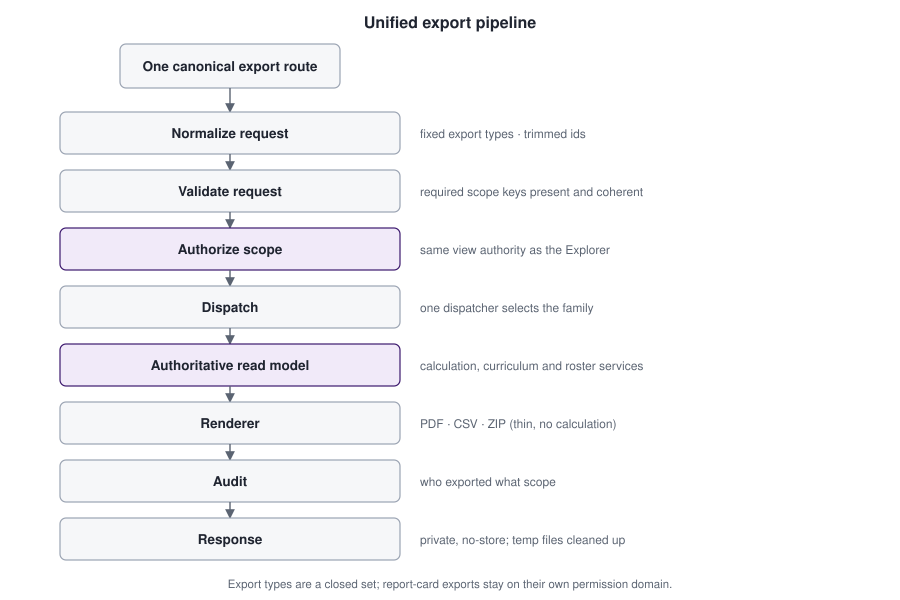

# Case study 3 — Unified export engine



## The problem

Before the Post-Orbit work, result output was reachable through several independent paths: a class/subject PDF action on the results page, a single-student PDF route, a report-card PDF route and a class ZIP route. Each path did its own request parsing, its own permission check and its own audit call. That is how inconsistent authorization and inconsistent output creep in.

## Design

**One canonical route and one dispatcher** handle a closed set of nine export types: student, subject and class PDF; student, subject and class ZIP; CSV; report-card PDF; and report-card ZIP.

```text
/result-export
   → normalize   (fixed type list, trimmed identifiers, no free-form values)
   → validate    (required scope keys present and coherent)
   → authorize   (same view authority as the Explorer)
   → dispatch    (one place chooses the family)
   → read model  (the authoritative model for that scope)
   → render      (PDF / CSV / ZIP — thin)
   → audit       (who exported which scope)
   → response    (private, no-store)
```

### The engine is not a second calculation engine

Renderers receive read models and lay them out. CSV is built from the same structured model, **not** scraped from HTML or PDF; it uses a fixed long-form schema (one row per student × subject). PDFs reuse the mature Class/Subject and Report Card renderers instead of rewriting them. A test enforces that the renderer files were not modified by the export-engine work.

### Security properties of the boundary

- **Read-only.** The export layer contains no data-modifying statements and cannot change lifecycle state or the active academic context; a test asserts this over the whole result/report-card file set.
- **Authorization parity.** Result exports use view authority; report-card exports use the separate report-card permissions. The route's early gate is widened only for those two report-card types.
- **Anti-forgery for report cards.** A supplied class or category that does not match the student's actual enrollment for that context is rejected.
- **Private documents.** Responses are private and no-store. PDFs are generated in memory; remote resources are disabled in the renderer.
- **ZIP hygiene.** Each entry gets a deterministic, sanitized file name with collision handling. The archive is built in a temporary file that is removed on success *and* on failure.
- **CSV formula-injection defence.** Free-text fields are neutralized so a value that starts like a spreadsheet formula cannot execute when opened. Numeric score columns are left numeric.
- **Missing versus zero.** Blank for missing in Student Result PDF/CSV; dash in the report-card and consolidated display layer; a real zero is always distinguishable.

## Compatibility strategy

Old URLs did not disappear on day one. Legacy routes were reduced to **thin wrappers** that delegate in-process to the canonical dispatcher, with a test asserting no duplicated logic remains. Internal links were migrated to the canonical route; wrappers remain for external bookmarks. One genuinely distinct route (a single-subject slice) was deliberately *not* migrated because it is a different feature, not a duplicate. Route registries (application router, route inventory and web-server map) are checked for consistency.

## Outcome

- One place to audit for authorization, logging and hygiene.
- Adding a new export family means adding a renderer and a dispatch entry, not a new route with its own security logic.
- Old links keep working during the migration window.

## Trade-offs

- A single dispatcher is a single point of failure for all exports; it is covered by the broadest tests for that reason.
- Wrappers add surface area until they are retired; they are classified in the route audit so their removal is a deliberate later step.
- Exports run synchronously on a small VM; bulk class ZIPs are bounded by request time and memory, and no background job queue is used.

## Evidence

Post-Orbit PO-5 to PO-9 test programs (Student Result PDF, export engine, report-card integration, compatibility cleanup, full regression). See [evidence/testing.md](../evidence/testing.md).
