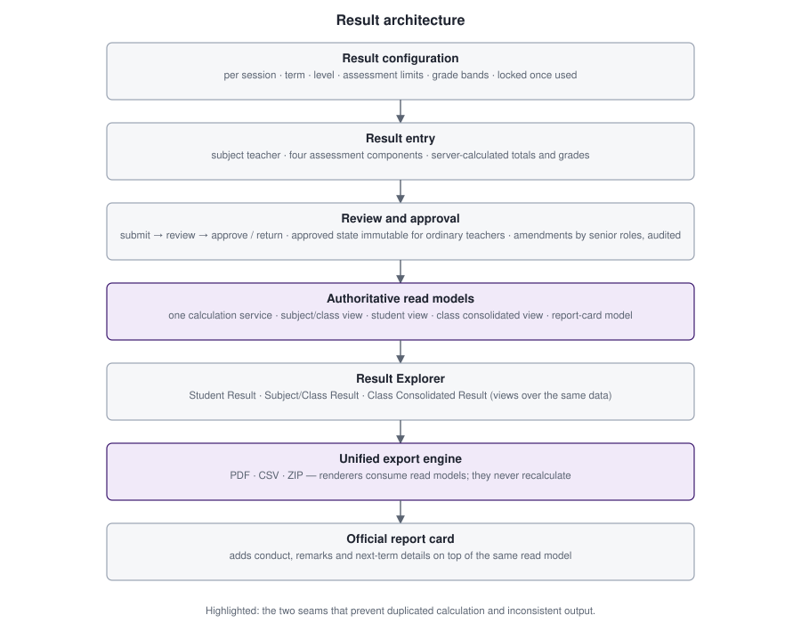

# Case study 1 — Result system architecture

Results are the most consequential data in a school platform: they are read by teachers, administrators, students and parents, printed on official documents, and compared across terms and years. This case study describes how the result pipeline is structured and how it evolved.

## The problem

The first result implementation (August 2026) was a workable entry-and-approval flow with report cards. As requirements grew, three weaknesses appeared:

1. **Multiple readers of the same data.** Screens, PDFs and report cards each risked computing totals, positions or applicability on their own. Any difference would put two different numbers in front of a parent.
2. **Active-context coupling.** Historical results were awkward to browse because much of the logic assumed the school's *current* session and term.
3. **Export sprawl.** Class PDFs, student PDFs, ZIPs and report cards were reachable through separate routes with separate authorization checks.

## Approach

The rule that governed the redesign: **preserve existing working behaviour and history, and never create a parallel result table or calculation engine when an authoritative service already exists.** Work proceeded as incremental phases rather than a rewrite.

### 1. Result lifecycle

Each result set moves through a controlled workflow: draft → submitted for review → approved (or returned with a reason). Ordinary teachers cannot edit an approved set. Post-approval amendments are restricted to senior roles, keep the set in the approved state, and write an explicit audit event. Transitions are recorded in an append-only workflow history in the same transaction as the state change.

### 2. Configuration that respects history

Assessment limits and grade bands are configured per session, term and level, and become locked once used. A carry-forward rule lets a new term start from the previous configuration without silently mutating past terms. Four assessment components (three continuous assessments and an exam) are scored, with totals and grades calculated by the server, not trusted from the browser.

### 3. Authoritative read models

One calculation service produces total, grade, last-term cumulative, cumulative, class average and position (standard competition ranking). On top of it sit read models for each perspective:

| Perspective | Answers |
|---|---|
| Subject/class result | One subject for one class + category, all eligible students |
| Student result | One student, every subject they actually take in that context |
| Class consolidated result | One class + category, all applicable subjects, all students |
| Report card | The student result plus conduct, remarks and term dates |

Screens, PDFs, CSV files, ZIP contents and report cards all consume these models. **No renderer contains a formula.** A regression test asserts there is no second calculation implementation anywhere in the result and export layer.

### 4. Curriculum-aware applicability

A student's subject list is derived from class, category and enrollment for the selected context, and a subject's student list from the same rules. There is deliberately no stored per-student subject registry. The read models also distinguish *missing* from *zero*: a subject with no published result appears as "not published", never as a 0.

### 5. Result Explorer

The Results area gained a single explorer with three modes (Student, Subject/Class, Class Consolidated) sharing one context bar: Session, Term, Class, Category, plus a mode-specific selector. Changing a higher-level filter invalidates lower ones. The session list offers only contexts the actor is authorized to see, so a teacher is not shown years with nothing they may open.

### 6. Official documents

Report cards remain a separate, official document from the Student Result: the Student Result is an analytic view of scores; the report card additionally carries character and conduct grades, teacher remarks, grading key and next-term date. Both are built from the same read model.

## Outcome

- Every result surface returns the same numbers because there is one path to them.
- Historical results can be viewed without touching the active academic context.
- The redesign shipped as small, separately tested steps (see [project evolution](project-evolution.md)) rather than one large rewrite.
- Two real defects found on the way (a submission-readiness check that blocked every four-component submission, and a query with a doubly-bound placeholder that made a report-card lookup always return nothing) were fixed at their source and covered by tests.

## Trade-offs

- Read models are recomputed per request instead of cached. This suits the school's scale and avoids cache invalidation bugs, but very large exports are bounded by request time on a small VM.
- Deriving subject applicability keeps data consistent, but means curriculum changes must be made carefully because they affect who appears in historical views; enrollment history and result locking limit that risk.

## Evidence

Test programs cover each Orbit and Post-Orbit phase, the class-teacher access rule and a final cross-cutting regression. See [testing and QA](testing-and-qa.md) and [evidence/testing.md](../evidence/testing.md).
